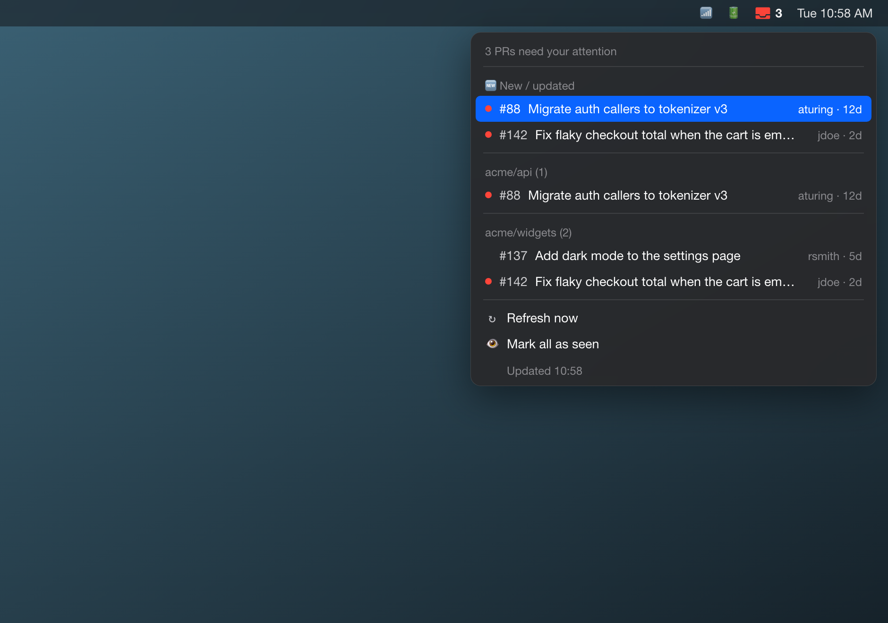
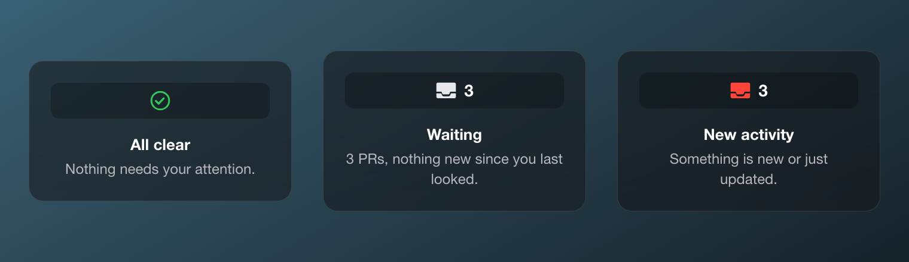

# pr-digest

A tiny tool that fetches your open GitHub pull requests and surfaces the ones
that need you — the PRs where you're a **requested reviewer** or the
**assignee**. Run it from the command line for a printed digest, or drop the
included **SwiftBar plugin** into your macOS menu bar for a glanceable count with
a "new activity" badge.

## Preview

The menu bar shows a count and turns red when something is new or updated since
you last looked. Open it for the full list, grouped by repo, as clickable links:



The icon at a glance:



> Screenshots use demo data (`PR_DIGEST_DEMO=1`); your real PRs never leave your
> machine.

## What it does

Using the GitHub REST search API (`GET /search/issues`), it runs two queries:

- `is:open is:pr review-requested:@me` — PRs waiting on your review
- `is:open is:pr assignee:@me` — PRs assigned to you

It de-duplicates across the two lists, prints a clean digest grouped by repo
(title, number, author, repo, age in days, URL) with a total count at the top,
and also writes the same digest to a timestamped file in `./digests/`. If
nothing's waiting, it prints `No PRs need your attention.`

## Setup

Requires Python 3.9+.

```bash
git clone https://github.com/m0n01d/pr-digest.git
cd pr-digest

# 1. Install dependencies (a virtualenv is recommended)
python3 -m venv .venv
source .venv/bin/activate
pip install -r requirements.txt

# 2. Configure your token
cp .env.example .env
# then edit .env and paste your token
```

### Token

The tool reads a GitHub personal access token from the `GITHUB_TOKEN`
environment variable — never hardcoded. It's loaded from `.env` via
[python-dotenv](https://pypi.org/project/python-dotenv/) if present, and `.env`
is git-ignored.

The token only needs **read-only** access to pull requests:

- **Fine-grained PAT**: Repository permissions → **Pull requests: Read**
- **Classic PAT**: the **`repo`** scope

Create one at <https://github.com/settings/tokens>.

## Run

```bash
# with the venv active and .env in place
python3 pr_digest.py

# or via the wrapper (also used by cron/launchd below)
./run
```

You can also pass the token inline instead of using `.env`:

```bash
GITHUB_TOKEN=ghp_xxx python3 pr_digest.py
```

## Menu bar app (SwiftBar)

For a glanceable view instead of a file, there's a [SwiftBar](https://swiftbar.app)
plugin. It puts an icon in your menu bar showing a **count** of PRs needing
attention, a **red tray badge** when something is **new or has new activity**
since you last looked, and a dropdown of the PRs grouped by repo as **clickable
links**. It refreshes **hourly** in the background and **re-fetches the moment
you open it**.

```bash
brew install --cask swiftbar

# Point SwiftBar at this repo's plugin folder, then launch it
# (use the absolute path to your clone — run `pwd` inside the repo)
defaults write com.ameba.SwiftBar PluginDirectory "$(pwd)/swiftbar-plugins"
open -a SwiftBar
```

On first launch SwiftBar may ask you to **choose the plugin folder** — pick
`pr-digest/swiftbar-plugins`. (macOS sandboxing means the folder sometimes has
to be granted through the picker, not just the `defaults` command above.)

It reuses the same `.env` token as the CLI, so no extra setup. The plugin
(`swiftbar_plugin.py`, launched by `swiftbar-plugins/prdigest.1h.sh`) shares the
fetch code in `gh_prs.py`.

**Reading the icon:**

| Menu bar | Meaning |
|---|---|
| ✅ (green check) | No PRs need your attention. |
| `3` 📥 | 3 PRs waiting; nothing new since you last opened the menu. |
| `3` 📥 (red) | 3 PRs, and at least one is new or has fresh activity. |

The red badge **persists through hourly refreshes** and clears once you **open
the menu** (SwiftBar tells the plugin it was opened via
`SWIFTBAR_PLUGIN_REFRESH_REASON=MenuOpen`). New/updated PRs are also listed in a
`🆕 New / updated` section at the top and flagged with a red dot. There's a
**Mark all as seen** item to clear the badge manually, and **Refresh now** to
re-fetch on demand.

"Seen" state is stored in `state/seen.json` (git-ignored) as a map of PR URL →
last-seen `updated_at`.

> The SwiftBar plugin handles the live view; it does **not** write to
> `digests/`. The dated digest files stay the job of the CLI / launchd schedule
> below, so you keep both a glanceable menu and a daily archived record.

## Scheduling

The CLI deliberately has **no built-in scheduler** — run it once and let your
OS schedule it. (SwiftBar self-refreshes, so this section is only needed for the
dated `digests/` file archive.)

### cron (Linux / macOS)

Run once each weekday morning at 9:00. Edit your crontab with `crontab -e`:

```cron
0 9 * * 1-5  cd /path/to/pr-digest && GITHUB_TOKEN=ghp_xxx ./run >> cron.log 2>&1
```

The `./run` wrapper `cd`s to its own directory and activates `.venv`, so it
works regardless of cron's working directory. If you keep your token in `.env`
you can drop the inline `GITHUB_TOKEN=` (the script loads `.env` itself).

### launchd (macOS, recommended alternative)

macOS prefers `launchd`. Save this as
`~/Library/LaunchAgents/com.example.pr-digest.plist` (replace the
`/path/to/pr-digest` paths with your clone), then load it with
`launchctl load ~/Library/LaunchAgents/com.example.pr-digest.plist`:

```xml
<?xml version="1.0" encoding="UTF-8"?>
<!DOCTYPE plist PUBLIC "-//Apple//DTD PLIST 1.0//EN"
  "http://www.apple.com/DTDs/PropertyList-1.0.dtd">
<plist version="1.0">
<dict>
  <key>Label</key>
  <string>com.example.pr-digest</string>

  <key>ProgramArguments</key>
  <array>
    <string>/path/to/pr-digest/run</string>
  </array>

  <key>EnvironmentVariables</key>
  <dict>
    <key>GITHUB_TOKEN</key>
    <string>ghp_xxx</string>
  </dict>

  <!-- Weekdays (1=Mon … 5=Fri) at 09:00. launchd uses one dict per day. -->
  <key>StartCalendarInterval</key>
  <array>
    <dict><key>Weekday</key><integer>1</integer><key>Hour</key><integer>9</integer><key>Minute</key><integer>0</integer></dict>
    <dict><key>Weekday</key><integer>2</integer><key>Hour</key><integer>9</integer><key>Minute</key><integer>0</integer></dict>
    <dict><key>Weekday</key><integer>3</integer><key>Hour</key><integer>9</integer><key>Minute</key><integer>0</integer></dict>
    <dict><key>Weekday</key><integer>4</integer><key>Hour</key><integer>9</integer><key>Minute</key><integer>0</integer></dict>
    <dict><key>Weekday</key><integer>5</integer><key>Hour</key><integer>9</integer><key>Minute</key><integer>0</integer></dict>
  </array>

  <key>StandardOutPath</key>
  <string>/path/to/pr-digest/cron.log</string>
  <key>StandardErrorPath</key>
  <string>/path/to/pr-digest/cron.log</string>
</dict>
</plist>
```

## Error handling

The tool exits non-zero with a clear message on:

- **Missing token** — tells you to set `GITHUB_TOKEN` and which scope it needs.
- **Auth failure (401)** — token invalid or expired.
- **Forbidden (403)** — token missing the required scope.
- **Rate limit** — reports when the limit resets.
- **Network errors** — surfaces the underlying problem.

## Files

| File | Purpose |
|---|---|
| `gh_prs.py` | Shared fetch/auth logic (used by both front-ends). |
| `pr_digest.py` | The CLI — prints the digest and writes the dated file. |
| `swiftbar_plugin.py` | The SwiftBar menu renderer + "seen" state. |
| `swiftbar-plugins/prdigest.1h.sh` | SwiftBar launcher (hourly + refresh-on-open). |
| `run` | Wrapper for cron/launchd (activates venv, fixes cwd). |
| `requirements.txt` | `requests`, `python-dotenv`. |
| `.env.example` | Template — copy to `.env`. |
| `docs/` | README screenshots. |
| `digests/`, `state/` | Generated output / seen-state (git-ignored). |
